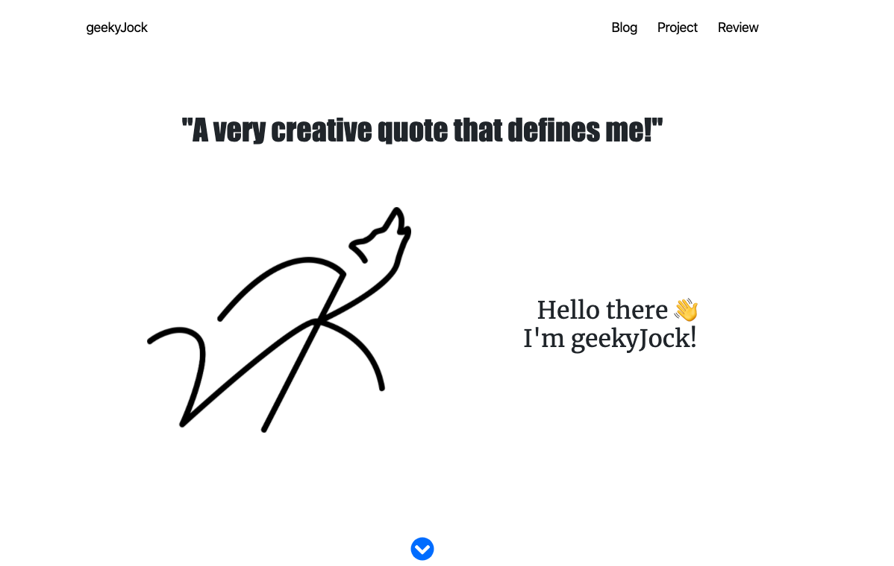

<h1 >
YAPB: Yet Another Portfolio Blog
</h1>



**YAPB: Yet Another Portfolio Blog** is an opinionated minimalistic portfolio and blog. It's built on top of [gatsby-personal-starter-blog](https://github.com/thomaswang/gatsby-personal-starter-blog). As a result it comes with Netlify CMS integration. The blog can be customised according to your needs. 

*So, go ahead and build your portfolio and write a world changing post.*

## 🚀 Quick start
1. **Install Gatsby**
    
    For more instruction checkout Gatsby official [tutorial](https://www.gatsbyjs.org/tutorial/part-zero/).
    ```sh
    npm install -g gatsby-cli
1.  **Create a Gatsby site**

    Use the Gatsby CLI to create a new site, specifying the blog starter.

    ```sh
    gatsby new my-blog-starter https://github.com/geekyJock8/yapb
    ```

1.  **Start developing**

    Navigate into your new site’s directory and start it up.

    ```sh
    cd my-blog-starter/
    gatsby develop
    ```

1.  **Your site is live!**

    Your site is now running at `http://localhost:8000`!

    _Note: You'll also see a second link: _`http://localhost:8000/___graphql`_. This is a tool you can use to experiment with querying your data. Learn more about using this tool in the [Gatsby tutorial](https://www.gatsbyjs.org/tutorial/part-five/#introducing-graphiql)._

    Open the `my-blog-starter` directory in your code editor of choice and start editing!

    Check out the Full documentation for Gatsby lives [on the website](https://www.gatsbyjs.org/).

## 📔 Deploying your site with Netlify

Start from [this point](https://www.gatsbyjs.org/docs/sourcing-from-netlify-cms/#authenticating-with-github) in the Gatsby documentation to finish the set up for your personal Netlify CMS with authentication.

## 📝 TODOs
There are so many things left to do:

1. Dark Mode
1. Image Support for Cards
1. Documentation
1. Animation Effects
1. Emailing List Support
1. Card Colors
1. Searching and Tagging
1. Refactoring CSS

## 🤝 Contributions
Feel free to help. There are no guidlines as of yet, but maybe you can help in buidling them.